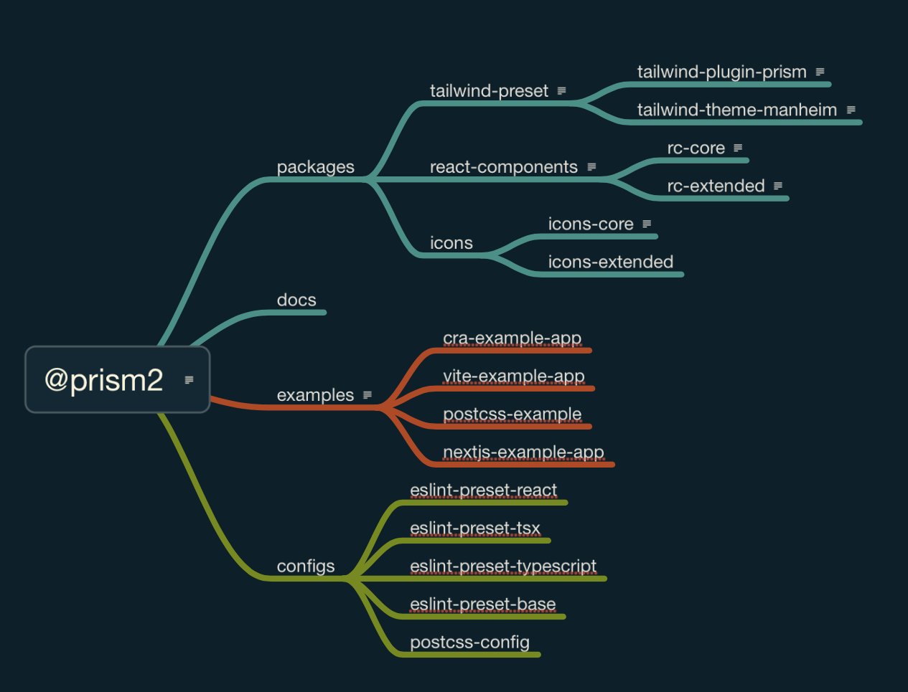
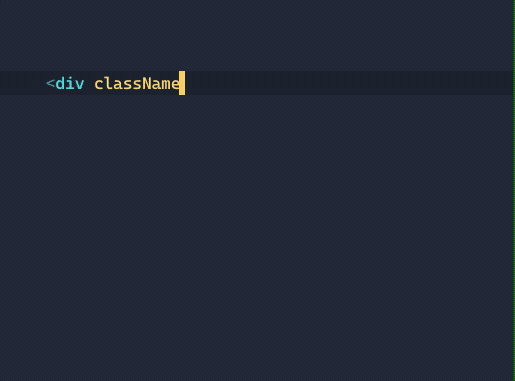

# @prism




## Quickstart

This project uses npm and turborepo to manage dependencies.

```
npm install
npm run storybook
```

Start a Storybook dev session using the contents of `packages/react-components/stories`

## Note on Commit Messages

We have implemented a requirement that all commit messages follow our conventions as [specified by Conventional Commits](https://www.conventionalcommits.org/en/v1.0.0/). Commits are cancelled if your message has any issues - actionable feedback will be provided with an error message.

```
git commit -m "chore: README updates for Turborepo"
⧗   input: chore: README updates for Turborepo
✖   subject must not be sentence-case, start-case, pascal-case, upper-case [subject-case]

✖   found 1 problems, 0 warnings
ⓘ   Get help: https://github.com/conventional-changelog/commitlint/#what-is-commitlint
```

## Starting a new project

```sh
// from ./packages directory
npm create vite@latest my-new-app --template react-ts
cd my-new-app
npm install
npm install -D tailwindcss @prism2/tailwind-preset @prism2/tailwind-theme @prism2/tailwind-elements postcss
npx tailwindcss init
```

Finally, create a `postcss.config.js` file in the root of your new project and add this:

```js
module.exports = require('@prism2/tailwind-preset/postcss.config')
```

Start your app and enjoy Prism2 flavored Tailwind3  :

```js
lerna run dev --scope=my-new-app
```


## Editor Configs

Prism2 includes autocompletion support via Typescript type declarations as well as through Tailwind Intellisense.

- [Tailwind CSS IntelliSense for VSCode](https://marketplace.visualstudio.com/items?itemName=bradlc.vscode-tailwindcss)



