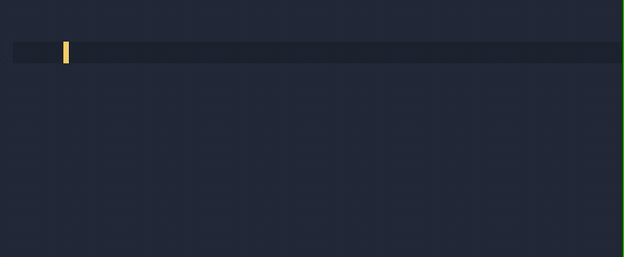

# prism2


This project uses lerna to manage monorepo dependencies.

```
npm install -g lerna
```

Use the built-in lerna commands to install dependencies across packages.

```
lerna bootstrap
```

Start a Storybook dev session using the contents of `packages/react-components/stories`

```
lerna run storybook --stream
```

## Editor Configs

Prism2 includes autocompletion support via Typescript type declarations as well as through Tailwind Intellisense.

- [Tailwind CSS IntelliSense for VSCode](https://marketplace.visualstudio.com/items?itemName=bradlc.vscode-tailwindcss)



