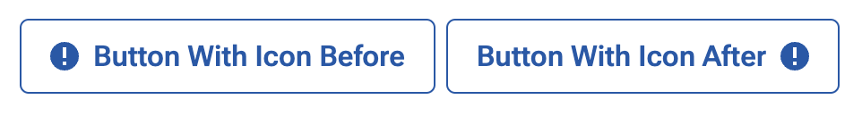

<p align="center">
  <a href="https://heroicons.com/#gh-light-mode-only" target="_blank">
    
  </a>
  <a href="https://heroicons.com/#gh-dark-mode-only" target="_blank">
    
  </a>
</p>

<p align="center">
  Beautiful hand-crafted SVG icons, by the makers of Tailwind CSS. <br>Available as basic SVG icons and via first-party <a href="#react">React</a> and <a href="#vue">Vue</a> libraries.
<p>

<p align="center">
  <a href="https://heroicons.com"><strong>Browse at Heroicons.com &rarr;</strong></a>
</p>

<p align="center">
    <a href="https://github.com/tailwindlabs/heroicons/releases"></a>
    <a href="https://github.com/tailwindlabs/heroicons/blob/master/LICENSE"></a>
</p>

## Quickstart

First, install `@prism2/icons-react` from Artifactory:

```sh
pnpm install @prism2/icons-react
```

Now each icon can be imported individually as a React component:

```js
import { CarIcon } from '@prism2/icons-react'

function MyComponent() {
  return (
    <div>
      <CarIcon className="h-6 w-6 text-blue-500"/>
      <p>...</p>
    </div>
  )
}
```

## Styling

Styling icons in Prism2 works the same as styling a div - we use `color` and `height` properties.

All React component icons behave like a normal SVG element - any attributes will be passed as-is the underlying SVG DOM node. If configured, your editor will complain if you try to pass HTML attributes that are not valid for an `<svg>` tag. Attributes such as `currentColor`, `className` and `data-testid` will be honored and be treated as valid.

### Sizing

Sizes must be passed explicitly, otherwise icons will render at full native size.

```jsx
 // icon is same as text size
<ArrowUpIcon className='h-[1em]' />

// icon is 1.5rem tall
<ArrowUpIcon className='h-6' />
```

### Color

By default, icons will inherit the text color of its parent via `currentColor`. It is recommended that any color customizations be done with a Tailwind class.

```jsx
// icon inherits branded blue color
<div className='text-blue-700'>
  <ThreeBarsIcon className='h-4' />
</div>
// a bright red cancel icon
<CancelCircleIcon className='h-4 text-red-500' />
// a ligh-gray icon
<BellIcon className='text-gray-100' />
```

### Appending and Prepending Text

Icons render a single SVG element - as a result, it is very simple to append or prepend text with an icon.



```jsx
<button className='prism-btn'>
  <NotificationCircleIcon className='h-[1em]' />
  Button With Icon Before
</button>

<button className='prism-btn'>
  Button With Icon After
  <NotificationCircleIcon className='h-[1em]' />
</button>
```

### Spinners & Animations

We have retired the `<Spinner />` component in favor of an animated icon. With Prism2, loading indicators can be rendered with:


```jsx
<SpinnerIcon className='h-8 text-gray-500 animate-spin' />
```


## Migrating From Prism 1

The Prism2 implementation of a given icon is always to use an upper camel case naming convention of the "glyph" property. They are always suffixed with the word `Icon`.

**Example**

```jsx
// Prism 1 React **icon**...
<Icon glyph='arrow-up' />
<IconSVG glyph='arrow-up' />
// or Prism1 font-based icons
<i className='prism-icon prism-icon-arrow-up' />
// Prism 2 equivelant
<ArrowUpIcon />
```
### Migration Table

You can use the table below to determine the 2.0 equivelent of any given glyph.

| Prism1 glyph | Prism2 Component |
| -------------| ---------------- |
| `alarm-add` | `<AlarmAddIconIcon />` | 
| `alarm-clock` | `<AlarmClockIconIcon />` | 
| `alarm-set` | `<AlarmSetIconIcon />` | 
| `arrow-down` | `<ArrowDownIconIcon />` | 
| `arrow-left` | `<ArrowLeftIconIcon />` | 
| `arrow-right` | `<ArrowRightIconIcon />` | 
| `arrow-up` | `<ArrowUpIconIcon />` | 
| `arrows-left-right` | `<ArrowsLeftRightIconIcon />` | 
| `arrows-up-down` | `<ArrowsUpDownIconIcon />` | 
| `attach` | `<AttachIconIcon />` | 
| `back-to-start` | `<BackToStartIconIcon />` | 
| `barcode` | `<BarcodeIconIcon />` | 
| `bell-o` | `<BellOIconIcon />` | 
| `bell` | `<BellIconIcon />` | 
| `blocked` | `<BlockedIconIcon />` | 
| `bolt` | `<BoltIconIcon />` | 
| `bubble` | `<BubbleIconIcon />` | 
| `bubbles` | `<BubblesIconIcon />` | 
| `bullet` | `<BulletIconIcon />` | 
| `calendar` | `<CalendarIconIcon />` | 
| `camcorder` | `<CamcorderIconIcon />` | 
| `camera` | `<CameraIconIcon />` | 
| `cancel-circle-o` | `<CancelCircleOIconIcon />` | 
| `cancel-circle` | `<CancelCircleIconIcon />` | 
| `car-side` | `<CarSideIconIcon />` | 
| `car` | `<CarIconIcon />` | 
| `checkbox-checked` | `<CheckboxCheckedIconIcon />` | 
| `checkbox-unchecked` | `<CheckboxUncheckedIconIcon />` | 
| `checkmark-circle` | `<CheckmarkCircleIconIcon />` | 
| `checkmark` | `<CheckmarkIconIcon />` | 
| `chevron-down-chamfered` | `<ChevronDownChamferedIconIcon />` | 
| `chevron-down-light` | `<ChevronDownLightIconIcon />` | 
| `chevron-down` | `<ChevronDownIconIcon />` | 
| `chevron-left-light` | `<ChevronLeftLightIconIcon />` | 
| `chevron-left` | `<ChevronLeftIconIcon />` | 
| `chevron-right-light` | `<ChevronRightLightIconIcon />` | 
| `chevron-right` | `<ChevronRightIconIcon />` | 
| `chevron-up-light` | `<ChevronUpLightIconIcon />` | 
| `chevron-up` | `<ChevronUpIconIcon />` | 
| `clipboard-checked` | `<ClipboardCheckedIconIcon />` | 
| `clipboard` | `<ClipboardIconIcon />` | 
| `clock` | `<ClockIconIcon />` | 
| `cloud-upload` | `<CloudUploadIconIcon />` | 
| `condition-report` | `<ConditionReportIconIcon />` | 
| `credit-card` | `<CreditCardIconIcon />` | 
| `cross-small` | `<CrossSmallIconIcon />` | 
| `cross` | `<CrossIconIcon />` | 
| `cup` | `<CupIconIcon />` | 
| `damages` | `<DamagesIconIcon />` | 
| `details` | `<DetailsIconIcon />` | 
| `direction` | `<DirectionIconIcon />` | 
| `disk` | `<DiskIconIcon />` | 
| `dollar-o` | `<DollarOIconIcon />` | 
| `download` | `<DownloadIconIcon />` | 
| `edit` | `<EditIconIcon />` | 
| `enlarge` | `<EnlargeIconIcon />` | 
| `envelop5` | `<Envelop5IconIcon />` | 
| `envelope` | `<EnvelopeIconIcon />` | 
| `envelope2` | `<Envelope2IconIcon />` | 
| `error-triangle` | `<ErrorTriangleIconIcon />` | 
| `export` | `<ExportIconIcon />` | 
| `eye-blocked` | `<EyeBlockedIconIcon />` | 
| `eye` | `<EyeIconIcon />` | 
| `file-empty` | `<FileEmptyIconIcon />` | 
| `file-excel` | `<FileExcelIconIcon />` | 
| `file-pdf` | `<FilePdfIconIcon />` | 
| `file-spreadsheet` | `<FileSpreadsheetIconIcon />` | 
| `file-text` | `<FileTextIconIcon />` | 
| `files-empty` | `<FilesEmptyIconIcon />` | 
| `filter` | `<FilterIconIcon />` | 
| `flag` | `<FlagIconIcon />` | 
| `fork-spoon` | `<ForkSpoonIconIcon />` | 
| `fuel` | `<FuelIconIcon />` | 
| `gavel` | `<GavelIconIcon />` | 
| `gear` | `<GearIconIcon />` | 
| `graph-pie` | `<GraphPieIconIcon />` | 
| `grid-small` | `<GridSmallIconIcon />` | 
| `grid` | `<GridIconIcon />` | 
| `grounding` | `<GroundingIconIcon />` | 
| `heart-o` | `<HeartOIconIcon />` | 
| `heart` | `<HeartIconIcon />` | 
| `home` | `<HomeIconIcon />` | 
| `image` | `<ImageIconIcon />` | 
| `images` | `<ImagesIconIcon />` | 
| `inbox` | `<InboxIconIcon />` | 
| `info-o` | `<InfoOIconIcon />` | 
| `info` | `<InfoIconIcon />` | 
| `leave` | `<LeaveIconIcon />` | 
| `left-right` | `<LeftRightIconIcon />` | 
| `link` | `<LinkIconIcon />` | 
| `list` | `<ListIconIcon />` | 
| `location-area` | `<LocationAreaIconIcon />` | 
| `location` | `<LocationIconIcon />` | 
| `locked` | `<LockedIconIcon />` | 
| `manheim-medallion` | `<ManheimMedallionIconIcon />` | 
| `marker` | `<MarkerIconIcon />` | 
| `medal` | `<MedalIconIcon />` | 
| `megaphone` | `<MegaphoneIconIcon />` | 
| `menu` | `<MenuIconIcon />` | 
| `minus-circle-o` | `<MinusCircleOIconIcon />` | 
| `minus-circle` | `<MinusCircleIconIcon />` | 
| `minus` | `<MinusIconIcon />` | 
| `minus2` | `<Minus2IconIcon />` | 
| `minus3` | `<Minus3IconIcon />` | 
| `mobile` | `<MobileIconIcon />` | 
| `new-window` | `<NewWindowIconIcon />` | 
| `notification-circle` | `<NotificationCircleIconIcon />` | 
| `odometer` | `<OdometerIconIcon />` | 
| `paint-can` | `<PaintCanIconIcon />` | 
| `paint-drop` | `<PaintDropIconIcon />` | 
| `pause` | `<PauseIconIcon />` | 
| `pin` | `<PinIconIcon />` | 
| `pin2` | `<Pin2IconIcon />` | 
| `play` | `<PlayIconIcon />` | 
| `plus-circle-o` | `<PlusCircleOIconIcon />` | 
| `plus-circle` | `<PlusCircleIconIcon />` | 
| `plus` | `<PlusIconIcon />` | 
| `price-tag` | `<PriceTagIconIcon />` | 
| `printer` | `<PrinterIconIcon />` | 
| `profile-ccw-circle-arrow` | `<ProfileCcwCircleArrowIconIcon />` | 
| `qr-code` | `<QrCodeIconIcon />` | 
| `refresh` | `<RefreshIconIcon />` | 
| `reset-time` | `<ResetTimeIconIcon />` | 
| `rotate-left` | `<RotateLeftIconIcon />` | 
| `rotate-right` | `<RotateRightIconIcon />` | 
| `search` | `<SearchIconIcon />` | 
| `shield-check` | `<ShieldCheckIconIcon />` | 
| `shield` | `<ShieldIconIcon />` | 
| `shrink` | `<ShrinkIconIcon />` | 
| `sort` | `<SortIconIcon />` | 
| `sound-off` | `<SoundOffIconIcon />` | 
| `sound-on` | `<SoundOnIconIcon />` | 
| `spinner` | `<SpinnerIconIcon />` | 
| `star-empty` | `<StarEmptyIconIcon />` | 
| `star-full` | `<StarFullIconIcon />` | 
| `star-half` | `<StarHalfIconIcon />` | 
| `stopwatch` | `<StopwatchIconIcon />` | 
| `three-bars` | `<ThreeBarsIconIcon />` | 
| `three-dots-horizontal` | `<ThreeDotsHorizontalIconIcon />` | 
| `three-dots-vertical` | `<ThreeDotsVerticalIconIcon />` | 
| `three-sixty-exterior` | `<ThreeSixtyExteriorIconIcon />` | 
| `three-sixty-interior-front` | `<ThreeSixtyInteriorFrontIconIcon />` | 
| `three-sixty-interior-rear` | `<ThreeSixtyInteriorRearIconIcon />` | 
| `three-sixty` | `<ThreeSixtyIconIcon />` | 
| `thumbs-down` | `<ThumbsDownIconIcon />` | 
| `thumbs-up` | `<ThumbsUpIconIcon />` | 
| `trash` | `<TrashIconIcon />` | 
| `triangle-down-small` | `<TriangleDownSmallIconIcon />` | 
| `triangle-down` | `<TriangleDownIconIcon />` | 
| `triangle-left-small` | `<TriangleLeftSmallIconIcon />` | 
| `triangle-left` | `<TriangleLeftIconIcon />` | 
| `triangle-right-small` | `<TriangleRightSmallIconIcon />` | 
| `triangle-right` | `<TriangleRightIconIcon />` | 
| `triangle-up-small` | `<TriangleUpSmallIconIcon />` | 
| `triangle-up` | `<TriangleUpIconIcon />` | 
| `truck` | `<TruckIconIcon />` | 
| `unlink` | `<UnlinkIconIcon />` | 
| `unlocked` | `<UnlockedIconIcon />` | 
| `upload` | `<UploadIconIcon />` | 
| `user-add` | `<UserAddIconIcon />` | 
| `user` | `<UserIconIcon />` | 
| `users` | `<UsersIconIcon />` | 
| `wifi` | `<WifiIconIcon />` | 
| `zoom-in` | `<ZoomInIconIcon />` | 
| `zoom-out` | `<ZoomOutIconIcon />` | 


## Aditional icons from Heroicons

We provide four distinct icon sets, the official Prism icons as well as Solid, Outline and Mini sets from [Heroicons]((https://heroicons.com). The three Heroicons sets each provide the same list of icons with their respective styling. The main Prism icon set uses a unique list of icons that *do not* overlap with the other sets.

```
import { BellIcon } from '@prism2/icons-react' // Prism icon set
import { BellIcon } from '@prism2/icons-react/24/solid' // Heroicons 'solid' set
import { BellIcon } from '@prism2/icons-react/24/outline' // Heroicons 'outline' set
import { BellIcon } from '@prism2/icons-react/20/solid' // Heroicons 'mini' set
```

The 24x24 outline icons can be imported from `@prism2/icons-react/24/outline`, the 24x24 solid icons can be imported from `@prism2/icons-react/24/solid`, and the 20x20 solid icons can be imported from `@prism2/icons-react/20/solid`.


