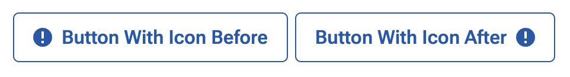

<p align="center">
  <a href="https://heroicons.com/#gh-light-mode-only" target="_blank">
    
  </a>
  <a href="https://heroicons.com/#gh-dark-mode-only" target="_blank">
    
  </a>
</p>

<p align="center">
  Beautiful hand-crafted SVG icons, by the makers of Tailwind CSS. <br>Available as basic SVG icons and via first-party <a href="#react">React</a> and <a href="#vue">Vue</a> libraries.
<p>

<p align="center">
  <a href="https://heroicons.com"><strong>Browse at Heroicons.com &rarr;</strong></a>
</p>

<p align="center">
    <a href="https://github.com/tailwindlabs/heroicons/releases"></a>
    <a href="https://github.com/tailwindlabs/heroicons/blob/master/LICENSE"></a>
</p>

## Quickstart

First, install `@prism2/icons-react` from Artifactory:

```sh
pnpm install @prism2/icons-react
```

Now each icon can be imported individually as a React component:

```js
import { CarIcon } from '@prism2/icons-react'

function MyComponent() {
  return (
    <div>
      <CarIcon className="h-6 w-6 text-blue-500"/>
      <p>...</p>
    </div>
  )
}
```

## Styling

Styling icons in Prism2 works the same as styling a div - we use `color` and `height` properties.

All React component icons behave like a normal SVG element - any attributes will be passed as-is the underlying SVG DOM node. If configured, your editor will complain if you try to pass HTML attributes that are not valid for an `<svg>` tag. Attributes such as `currentColor`, `className` and `data-testid` will be honored and be treated as valid.

### Sizing

Sizes must be passed explicitly, otherwise icons will render at full native size.

```jsx
 // icon is same as text size
<ArrowUpIcon className='h-[1em]' />

// icon is 1.5rem tall
<ArrowUpIcon className='h-6' />
```

### Color

By default, icons will inherit the text color of its parent via `currentColor`. It is recommended that any color customizations be done with a Tailwind class.

```jsx
// icon inherits branded blue color
<div className='text-blue-700'>
  <ThreeBarsIcon className='h-4' />
</div>
// a bright red cancel icon
<CancelCircleIcon className='h-4 text-red-500' />
// a ligh-gray icon
<BellIcon className='text-gray-100' />
```

### Appending and Prepending Text

Icons render a single SVG element - as a result, it is very simple to append or prepend text with an icon.



```jsx
<button className='prism-btn'>
  <NotificationCircleIcon className='h-[1em]' />
  Button With Icon Before
</button>

// or with the Reac component
<Button prepend={<NotificationCircleIcon />}>Button with Icon Before</Button>
<Button append={<NotificationCircleIcon />}>Button with Icon After</Button>
```

### Using scoped styles

With Tailwind, we can inherit icon styles from the parent. Below is an example of how we can style child SVGs using Tailwind utility classes.

```jsx
<div>
  <ArrowLeftIcon className='h-6' />
  <ArrowRightIcon className='h-6' />
  <ArrowDownIcon className='h-6' />
<div>
// is the same as
<div className="icons:h-6">
  <ArrowLeftIcon />
  <ArrowRightIcon />
  <ArrowDownIcon />
<div>
```


### Spinners & Animations

We have retired the `<Spinner />` component in favor of an animated icon. With Prism2, loading indicators can be rendered with:


```jsx
<SpinnerIcon className='h-8 text-gray-500 animate-spin' />
```


## Migrating From Prism 1

The Prism2 implementation of a given icon is always to use an upper camel case naming convention of the "glyph" property. They are always suffixed with the word `Icon`.

**Example**

```jsx
// Prism 1 React **icon**...
<Icon glyph='arrow-up' />
<IconSVG glyph='arrow-up' />
// or Prism1 font-based icons
<i className='prism-icon prism-icon-arrow-up' />
// Prism 2 equivelant
<ArrowUpIcon />
```
### Migration Table

You can use the table below to determine the 2.0 equivelent of any given glyph.

| Prism1 glyph | Prism2 Component |
| -------------| ---------------- |
| `alarm-add` | `<AlarmAddIcon />` | 
| `alarm-clock` | `<AlarmClockIcon />` | 
| `alarm-set` | `<AlarmSetIcon />` | 
| `arrow-down` | `<ArrowDownIcon />` | 
| `arrow-left` | `<ArrowLeftIcon />` | 
| `arrow-right` | `<ArrowRightIcon />` | 
| `arrow-up` | `<ArrowUpIcon />` | 
| `arrows-left-right` | `<ArrowsLeftRightIcon />` | 
| `arrows-up-down` | `<ArrowsUpDownIcon />` | 
| `attach` | `<AttachIcon />` | 
| `back-to-start` | `<BackToStartIcon />` | 
| `barcode` | `<BarcodeIcon />` | 
| `bell-o` | `<BellOIcon />` | 
| `bell` | `<BellIcon />` | 
| `blocked` | `<BlockedIcon />` | 
| `bolt` | `<BoltIcon />` | 
| `bubble` | `<BubbleIcon />` | 
| `bubbles` | `<BubblesIcon />` | 
| `bullet` | `<BulletIcon />` | 
| `calendar` | `<CalendarIcon />` | 
| `camcorder` | `<CamcorderIcon />` | 
| `camera` | `<CameraIcon />` | 
| `cancel-circle-o` | `<CancelCircleOIcon />` | 
| `cancel-circle` | `<CancelCircleIcon />` | 
| `car-side` | `<CarSideIcon />` | 
| `car` | `<CarIcon />` | 
| `checkbox-checked` | `<CheckboxCheckedIcon />` | 
| `checkbox-unchecked` | `<CheckboxUncheckedIcon />` | 
| `checkmark-circle` | `<CheckmarkCircleIcon />` | 
| `checkmark` | `<CheckmarkIcon />` | 
| `chevron-down-chamfered` | `<ChevronDownChamferedIcon />` | 
| `chevron-down-light` | `<ChevronDownLightIcon />` | 
| `chevron-down` | `<ChevronDownIcon />` | 
| `chevron-left-light` | `<ChevronLeftLightIcon />` | 
| `chevron-left` | `<ChevronLeftIcon />` | 
| `chevron-right-light` | `<ChevronRightLightIcon />` | 
| `chevron-right` | `<ChevronRightIcon />` | 
| `chevron-up-light` | `<ChevronUpLightIcon />` | 
| `chevron-up` | `<ChevronUpIcon />` | 
| `clipboard-checked` | `<ClipboardCheckedIcon />` | 
| `clipboard` | `<ClipboardIcon />` | 
| `clock` | `<ClockIcon />` | 
| `cloud-upload` | `<CloudUploadIcon />` | 
| `condition-report` | `<ConditionReportIcon />` | 
| `credit-card` | `<CreditCardIcon />` | 
| `cross-small` | `<CrossSmallIcon />` | 
| `cross` | `<CrossIcon />` | 
| `cup` | `<CupIcon />` | 
| `damages` | `<DamagesIcon />` | 
| `details` | `<DetailsIcon />` | 
| `direction` | `<DirectionIcon />` | 
| `disk` | `<DiskIcon />` | 
| `dollar-o` | `<DollarOIcon />` | 
| `download` | `<DownloadIcon />` | 
| `edit` | `<EditIcon />` | 
| `enlarge` | `<EnlargeIcon />` | 
| `envelop5` | `<Envelop5Icon />` | 
| `envelope` | `<EnvelopeIcon />` | 
| `envelope2` | `<Envelope2Icon />` | 
| `error-triangle` | `<ErrorTriangleIcon />` | 
| `export` | `<ExportIcon />` | 
| `eye-blocked` | `<EyeBlockedIcon />` | 
| `eye` | `<EyeIcon />` | 
| `file-empty` | `<FileEmptyIcon />` | 
| `file-excel` | `<FileExcelIcon />` | 
| `file-pdf` | `<FilePdfIcon />` | 
| `file-spreadsheet` | `<FileSpreadsheetIcon />` | 
| `file-text` | `<FileTextIcon />` | 
| `files-empty` | `<FilesEmptyIcon />` | 
| `filter` | `<FilterIcon />` | 
| `flag` | `<FlagIcon />` | 
| `fork-spoon` | `<ForkSpoonIcon />` | 
| `fuel` | `<FuelIcon />` | 
| `gavel` | `<GavelIcon />` | 
| `gear` | `<GearIcon />` | 
| `graph-pie` | `<GraphPieIcon />` | 
| `grid-small` | `<GridSmallIcon />` | 
| `grid` | `<GridIcon />` | 
| `grounding` | `<GroundingIcon />` | 
| `heart-o` | `<HeartOIcon />` | 
| `heart` | `<HeartIcon />` | 
| `home` | `<HomeIcon />` | 
| `image` | `<ImageIcon />` | 
| `images` | `<ImagesIcon />` | 
| `inbox` | `<InboxIcon />` | 
| `info-o` | `<InfoOIcon />` | 
| `info` | `<InfoIcon />` | 
| `leave` | `<LeaveIcon />` | 
| `left-right` | `<LeftRightIcon />` | 
| `link` | `<LinkIcon />` | 
| `list` | `<ListIcon />` | 
| `location-area` | `<LocationAreaIcon />` | 
| `location` | `<LocationIcon />` | 
| `locked` | `<LockedIcon />` | 
| `manheim-medallion` | `<ManheimMedallionIcon />` | 
| `marker` | `<MarkerIcon />` | 
| `medal` | `<MedalIcon />` | 
| `megaphone` | `<MegaphoneIcon />` | 
| `menu` | `<MenuIcon />` | 
| `minus-circle-o` | `<MinusCircleOIcon />` | 
| `minus-circle` | `<MinusCircleIcon />` | 
| `minus` | `<MinusIcon />` | 
| `minus2` | `<Minus2Icon />` | 
| `minus3` | `<Minus3Icon />` | 
| `mobile` | `<MobileIcon />` | 
| `new-window` | `<NewWindowIcon />` | 
| `notification-circle` | `<NotificationCircleIcon />` | 
| `odometer` | `<OdometerIcon />` | 
| `paint-can` | `<PaintCanIcon />` | 
| `paint-drop` | `<PaintDropIcon />` | 
| `pause` | `<PauseIcon />` | 
| `pin` | `<PinIcon />` | 
| `pin2` | `<Pin2Icon />` | 
| `play` | `<PlayIcon />` | 
| `plus-circle-o` | `<PlusCircleOIcon />` | 
| `plus-circle` | `<PlusCircleIcon />` | 
| `plus` | `<PlusIcon />` | 
| `price-tag` | `<PriceTagIcon />` | 
| `printer` | `<PrinterIcon />` | 
| `profile-ccw-circle-arrow` | `<ProfileCcwCircleArrowIcon />` | 
| `qr-code` | `<QrCodeIcon />` | 
| `refresh` | `<RefreshIcon />` | 
| `reset-time` | `<ResetTimeIcon />` | 
| `rotate-left` | `<RotateLeftIcon />` | 
| `rotate-right` | `<RotateRightIcon />` | 
| `search` | `<SearchIcon />` | 
| `shield-check` | `<ShieldCheckIcon />` | 
| `shield` | `<ShieldIcon />` | 
| `shrink` | `<ShrinkIcon />` | 
| `sort` | `<SortIcon />` | 
| `sound-off` | `<SoundOffIcon />` | 
| `sound-on` | `<SoundOnIcon />` | 
| `spinner` | `<SpinnerIcon />` | 
| `star-empty` | `<StarEmptyIcon />` | 
| `star-full` | `<StarFullIcon />` | 
| `star-half` | `<StarHalfIcon />` | 
| `stopwatch` | `<StopwatchIcon />` | 
| `three-bars` | `<ThreeBarsIcon />` | 
| `three-dots-horizontal` | `<ThreeDotsHorizontalIcon />` | 
| `three-dots-vertical` | `<ThreeDotsVerticalIcon />` | 
| `three-sixty-exterior` | `<ThreeSixtyExteriorIcon />` | 
| `three-sixty-interior-front` | `<ThreeSixtyInteriorFrontIcon />` | 
| `three-sixty-interior-rear` | `<ThreeSixtyInteriorRearIcon />` | 
| `three-sixty` | `<ThreeSixtyIcon />` | 
| `thumbs-down` | `<ThumbsDownIcon />` | 
| `thumbs-up` | `<ThumbsUpIcon />` | 
| `trash` | `<TrashIcon />` | 
| `triangle-down-small` | `<TriangleDownSmallIcon />` | 
| `triangle-down` | `<TriangleDownIcon />` | 
| `triangle-left-small` | `<TriangleLeftSmallIcon />` | 
| `triangle-left` | `<TriangleLeftIcon />` | 
| `triangle-right-small` | `<TriangleRightSmallIcon />` | 
| `triangle-right` | `<TriangleRightIcon />` | 
| `triangle-up-small` | `<TriangleUpSmallIcon />` | 
| `triangle-up` | `<TriangleUpIcon />` | 
| `truck` | `<TruckIcon />` | 
| `unlink` | `<UnlinkIcon />` | 
| `unlocked` | `<UnlockedIcon />` | 
| `upload` | `<UploadIcon />` | 
| `user-add` | `<UserAddIcon />` | 
| `user` | `<UserIcon />` | 
| `users` | `<UsersIcon />` | 
| `wifi` | `<WifiIcon />` | 
| `zoom-in` | `<ZoomInIcon />` | 
| `zoom-out` | `<ZoomOutIcon />` | 


## Aditional icons from Heroicons

We provide four distinct icon sets, the official Prism icons as well as Solid, Outline and Mini sets from [Heroicons]((https://heroicons.com). The three Heroicons sets each provide the same list of icons with their respective styling. The main Prism icon set uses a unique list of icons that *do not* overlap with the other sets.

```
import { BellIcon } from '@prism2/icons-react' // Prism icon set
import { BellIcon } from '@prism2/icons-react/24/solid' // Heroicons 'solid' set
import { BellIcon } from '@prism2/icons-react/24/outline' // Heroicons 'outline' set
import { BellIcon } from '@prism2/icons-react/20/solid' // Heroicons 'mini' set
```

The 24x24 outline icons can be imported from `@prism2/icons-react/24/outline`, the 24x24 solid icons can be imported from `@prism2/icons-react/24/solid`, and the 20x20 solid icons can be imported from `@prism2/icons-react/20/solid`.


