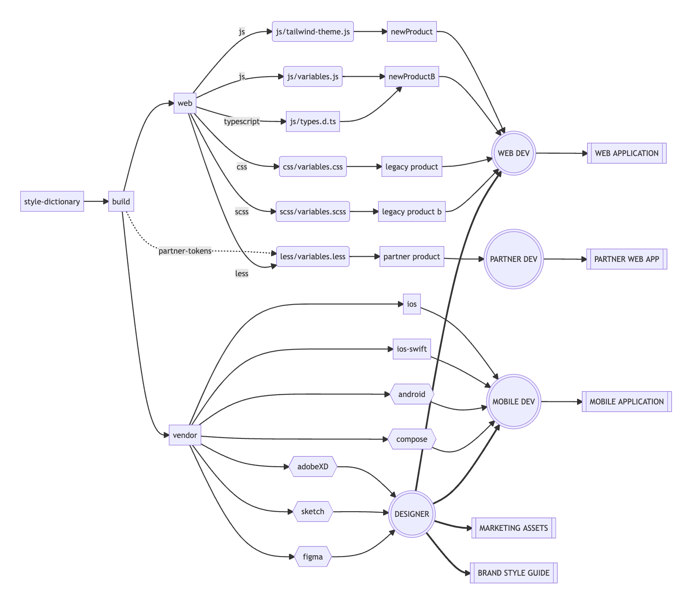
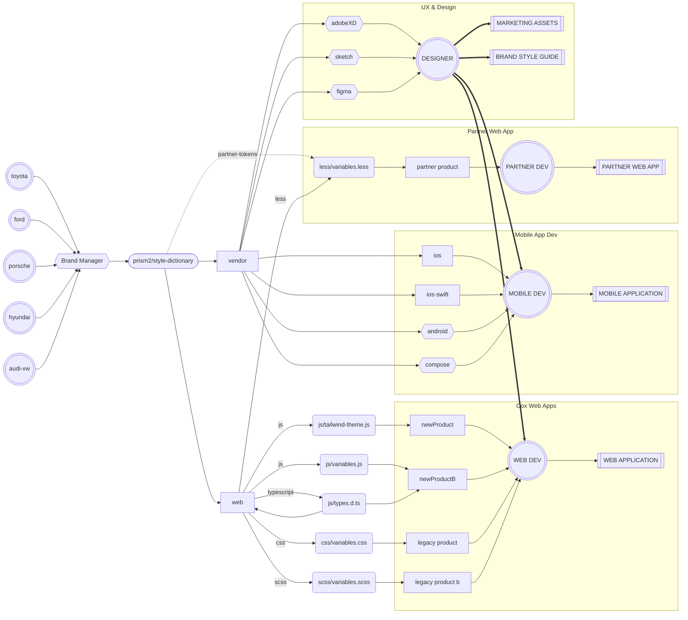

# Basic Style Dictionary


## Token Flow



---

## Usage Examples

### CSS and CSS Preprocessors

```jsx
import '@prism2/style-dictionary/build/css/variables.css' // css
import '@prism2/style-dictionary/build/scss/variables.scss' // scss/sass
import '@prism2/style-dictionary/build/less/variables.less' // less
```
```css
.my-element {
  fontFamily: var(--p2-base-font-family-sans);
  color: var(--p2-base-colors-gray-900);
  backgroundColor: var(--p2-base-colors-gray-50);
}
```


### Tailwind
```js
// tailwind.config.js
module.exports = {
  theme: {
    extend: require('@prism2/style-dictionary/build/js/tokens).p2.base
  }
}
```
```jsx
const MyElement = () => <div className='font-sans text-gray-900 bg-gray-50'>
```

### iOS

**iOS**
```objc
#import "StyleDictionaryColor.h"

@implementation StyleDictionaryColor
```

---

## About this package

This example code is bare-bones to show you what this framework can do. If you have the style-dictionary module installed globally, you can `cd` into this directory and run:
```bash
style-dictionary build
```

You should see something like this output:
```
Copying starter files...

Source style dictionary starter files created!

Running `style-dictionary build` for the first time to generate build artifacts.


scss
✔︎  build/scss/_variables.scss

android
✔︎  build/android/font_dimens.xml
✔︎  build/android/colors.xml

compose
✔︎ build/compose/StyleDictionaryColor.kt
✔︎ build/compose/StyleDictionarySize.kt

ios
✔︎  build/ios/StyleDictionaryColor.h
✔︎  build/ios/StyleDictionaryColor.m
✔︎  build/ios/StyleDictionarySize.h
✔︎  build/ios/StyleDictionarySize.m

ios-swift
✔︎  build/ios-swift/StyleDictionary.swift

ios-swift-separate-enums
✔︎  build/ios-swift/StyleDictionaryColor.swift
✔︎  build/ios-swift/StyleDictionarySize.swift
```

Good for you! You have now built your first style dictionary! Moving on, take a look at what we have built. This should have created a build directory and it should look like this:
```
├── README.md
├── config.json
├── tokens/
│   ├── color/
│       ├── base.json
│       ├── font.json
│   ├── size/
│       ├── font.json
├── build/
│   ├── android/
│      ├── font_dimens.xml
│      ├── colors.xml
│   ├── compose/
│      ├── StyleDictionaryColor.kt
│      ├── StyleDictionarySize.kt
│   ├── scss/
│      ├── _variables.scss
│   ├── ios/
│      ├── StyleDictionaryColor.h
│      ├── StyleDictionaryColor.m
│      ├── StyleDictionarySize.h
│      ├── StyleDictionarySize.m
│   ├── ios-swift/
│      ├── StyleDictionary.swift
│      ├── StyleDictionaryColor.swift
│      ├── StyleDictionarySize.swift
```

If you open `config.json` you will see there are 5 platforms defined: scss, android, compose, ios, and ios-swift. Each platform has a transformGroup, buildPath, and files. The buildPath and files of the platform should match up to the files what were built. The files built should look like these:

**Android**
```xml
<!-- font_dimens.xml -->
<resources>
  <dimen name="size_font_small">12.00sp</dimen>
  <dimen name="size_font_medium">16.00sp</dimen>
  <dimen name="size_font_large">32.00sp</dimen>
  <dimen name="size_font_base">16.00sp</dimen>
</resources>

<!-- colors.xml -->
<resources>
  <color name="color_base_gray_light">#ffcccccc</color>
  <color name="color_base_gray_medium">#ff999999</color>
  <color name="color_base_gray_dark">#ff111111</color>
  <color name="color_base_red">#ffff0000</color>
  <color name="color_base_green">#ff00ff00</color>
  <color name="color_font_base">#ffff0000</color>
  <color name="color_font_secondary">#ff00ff00</color>
  <color name="color_font_tertiary">#ffcccccc</color>
</resources>
```

**Compose**
```kotlin
object StyleDictionaryColor {
  val colorBaseGrayDark = Color(0xff111111)
  val colorBaseGrayLight = Color(0xffcccccc)
  val colorBaseGrayMedium = Color(0xff999999)
  val colorBaseGreen = Color(0xff00ff00)
  val colorBaseRed = Color(0xffff0000)
  val colorFontBase = Color(0xffff0000)
  val colorFontSecondary = Color(0xff00ff00)
  val colorFontTertiary = Color(0xffcccccc)
}

object StyleDictionarySize {
  /** the base size of the font */
  val sizeFontBase = 16.00.sp
  /** the large size of the font */
  val sizeFontLarge = 32.00.sp
  /** the medium size of the font */
  val sizeFontMedium = 16.00.sp
  /** the small size of the font */
  val sizeFontSmall = 12.00.sp
}
```

**SCSS**
```scss
// variables.scss
$color-base-gray-light: #cccccc;
$color-base-gray-medium: #999999;
$color-base-gray-dark: #111111;
$color-base-red: #ff0000;
$color-base-green: #00ff00;
$color-font-base: #ff0000;
$color-font-secondary: #00ff00;
$color-font-tertiary: #cccccc;
$size-font-small: 0.75rem;
$size-font-medium: 1rem;
$size-font-large: 2rem;
$size-font-base: 1rem;
```

**iOS**
```objc
#import "StyleDictionaryColor.h"

@implementation StyleDictionaryColor

+ (UIColor *)color:(StyleDictionaryColorName)colorEnum{
  return [[self values] objectAtIndex:colorEnum];
}

+ (NSArray *)values {
  static NSArray* colorArray;
  static dispatch_once_t onceToken;

  dispatch_once(&onceToken, ^{
    colorArray = @[
[UIColor colorWithRed:0.800f green:0.800f blue:0.800f alpha:1.000f],
[UIColor colorWithRed:0.600f green:0.600f blue:0.600f alpha:1.000f],
[UIColor colorWithRed:0.067f green:0.067f blue:0.067f alpha:1.000f],
[UIColor colorWithRed:1.000f green:0.000f blue:0.000f alpha:1.000f],
[UIColor colorWithRed:0.000f green:1.000f blue:0.000f alpha:1.000f],
[UIColor colorWithRed:1.000f green:0.000f blue:0.000f alpha:1.000f],
[UIColor colorWithRed:0.000f green:1.000f blue:0.000f alpha:1.000f],
[UIColor colorWithRed:0.800f green:0.800f blue:0.800f alpha:1.000f]
    ];
  });

  return colorArray;
}

@end
```

Pretty nifty! This shows a few things happening:
1. The build system does a deep merge of all the token JSON files defined in the `source` attribute of `config.json`. This allows you to split up the token JSON files however you want. There are 2 JSON files with `color` as the top level key, but they get merged properly.
1. The build system resolves references to other design tokens. `{size.font.medium.value}` gets resolved properly.
1. The build system handles references to token values in other files as well as you can see in `tokens/color/font.json`.

Now let's make a change and see how that affects things. Open up `tokens/color/base.json` and change `"#111111"` to `"#000000"`. After you make that change, save the file and re-run the build command `style-dictionary build`. Open up the build files and take a look.

**Huzzah!**

Now go forth and create! Take a look at all the built-in [transforms](https://amzn.github.io/style-dictionary/#/transforms?id=pre-defined-transforms) and [formats](https://amzn.github.io/style-dictionary/#/formats?id=pre-defined-formats).
