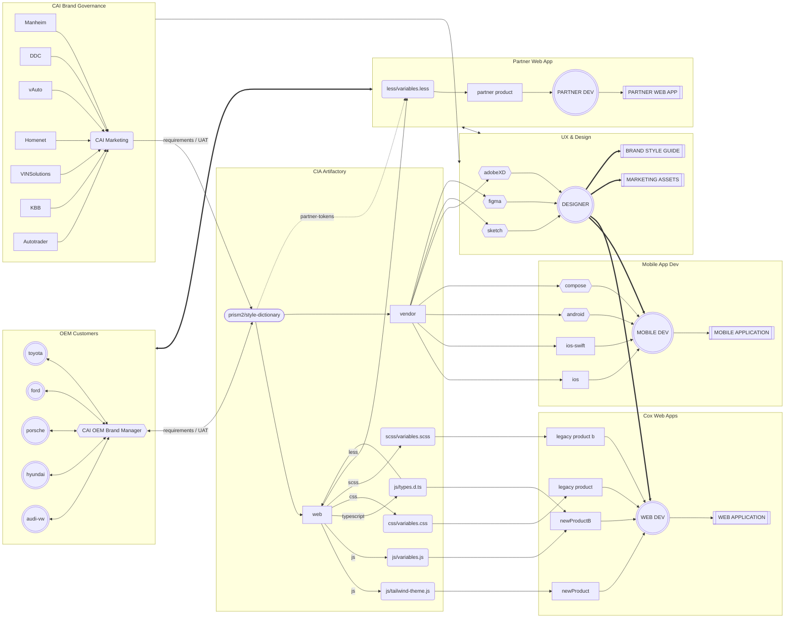

## Cox Auto Product Design Unification

- Organizational assesmment - identify stakeholders, key working relationships, existing product initiatives and roadmaps.

```mermaid

flowchart LR
  sd([ prism2/style-dictionary ])-->web
  sd-->vendor
  sd-. partner-tokens .->less

  subgraph artifactory [CIA Artifactory]
    sd
    web & vendor
    tw & ts & css & scss & js
  end

  web-->|js|tw(js/tailwind-theme.js)
  web-->|js|js(js/variables.js)
  web-->|typescript|ts(js/types.d.ts)-->
  web-->|css|css(css/variables.css)
  web-->|scss|scss(scss/variables.scss)
  web-->|less|less(less/variables.less)
    tw-->newProduct
    js-->newProductB
    ts-->newProductB
    css-->legacy[legacy product]
    scss-->l2[legacy product b]

      subgraph cox [Cox Web Apps]
        newProduct-->wd(((WEB DEV)))
        newProductB-->wd(((WEB DEV)))
        legacy-->wd(((WEB DEV)))
        l2-->wd(((WEB DEV)))
        wd-->wa[[WEB APPLICATION]]
      end

    subgraph partner [Partner Web App]
    less-->l3[partner product]
      l3-->pd(((PARTNER DEV)))
        pd-->pa[[PARTNER WEB APP]]
    end

  subgraph partnerx [OEM Customers]
    toyota(((toyota)))<-->t3
    ford((( ford )))<-->t3
    porsche(((porsche)))<-->t3
    hyundai(((hyundai)))<-->t3
    audi-vw(((audi-vw)))<-->t3
  end
  partnerx<==>partner
  partner<-->design
  t3{{CAI OEM Brand Manager}}
  t3<-->|requirements / UAT|sd

  subgraph brand [CAI Brand Governance]
    Manheim-->t4(CAI Marketing)
    DDC-->t4
    vAuto-->t4
    Homenet-->t4
    VINSolutions-->t4
    KBB-->t4
    Autotrader-->t4
  end
  t4-->|requirements / UAT|sd
  brand-->design


  vendor-->ios
  vendor-->swift[ios-swift]
  vendor-->android{{android}}
  vendor-->compose{{compose}}
  vendor-->adobeXD{{adobeXD}}
  vendor-->sketch{{sketch}}
  vendor-->figma{{figma}}

    subgraph mobile [Mobile App Dev]
    ios-->md(((MOBILE DEV)))
    swift-->md(((MOBILE DEV)))
    android-->md(((MOBILE DEV)))
    compose-->md(((MOBILE DEV)))
      md-->ma[[MOBILE APPLICATION]]
    end

    subgraph design [UX & Design]
    adobeXD-->d
    sketch-->d(((DESIGNER)))
    figma-->d(((DESIGNER)))
      d==>md
      d==>wd
      d==>mats[[MARKETING ASSETS]]
      d==>sg[[BRAND STYLE GUIDE]]
    end

```
