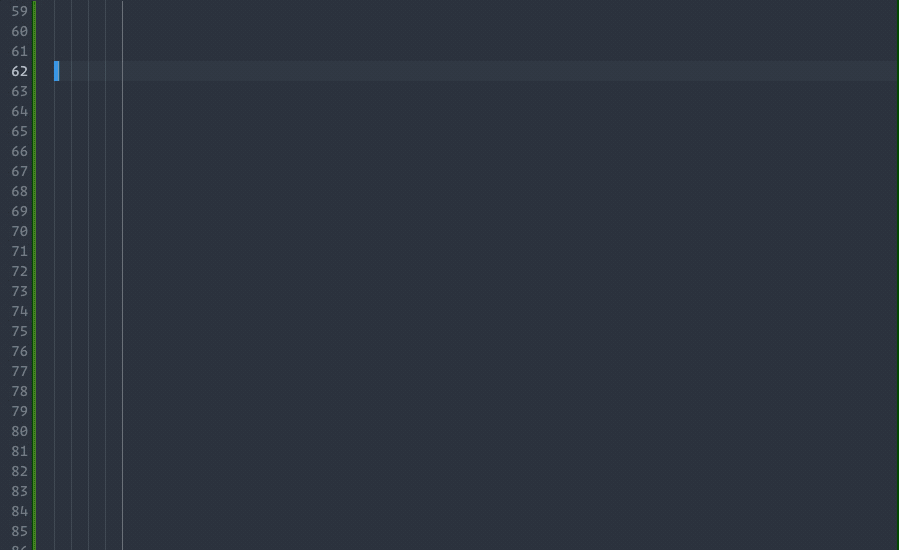

# @prism2/tailwind-elements

Prism2 includes a CSS reset that provides out-of-the-box styling for most HTML5 elements.
`@prism2/tailwind-elements` provides a flexible way to generate styles for your app or component.
In some cases, you may want to apply design guidelines directly to HTML5 elements.



## Quickstart

> **Prerequisite**: This guide expects Tailwind to already be configured. Follow the [instructions to initialize Tailwind](https://tailwindcss.com/docs/installation) in your project if you haven't already.

> **Notice**: In most cases, you can use the `@prism2/tailwind-preset` which provides configuration for this plugin and our theme. This guide is intended for custom use cases where the preset is insufficient.

```sh
npm install @prism2/tailwind-elements
```

```js
// tailwind.config.js
plugins: [
  require("@prism2/tailwind-elements")({
    parent: '.prism', // scope rules to children of this CSS selector.
    strategy: 'class', // only generate class styles, ex: .heading-01,
    prefix: 'prism' // prefix class names, ex: .prism-heading-01.
  }),
],
```

## Plugin Strategy

The `@prism2/tailwind-elements` plugin allows you to pass a configuration object to customize how styles are provided in your app.


### Apply styles as HTML reset
```jsx
// tailwind.config.js
plugins: [ require('@prism2/tailwind-elements')({ strategy: 'base' }) ]
// App.tsx
const Component = () => <h1>I am styled</h1>
```

### Scope styles to a parent selector
```jsx
// tailwind.config.js
plugins: [ require('@prism2/tailwind-elements')({
  parent: '.use-prism', // for children of .use-prism
  strategy: 'base', // style base HTML elements like <h1> etc.
}) ]

// App.tsx
const Unstyled = () => <h1>I am unstyled</h1>
const Styled = () => <div className='use-prism'><h1>I am styled</h1></div>
```

### Use styles with classes
```jsx
// tailwind.config.js
plugins: [ require('@prism2/tailwind-elements')({
  strategy: 'class',  // style with classes like .prism-heading-01 etc.
}) ]

// App.tsx
const Unstyled = () => <h1>I am unstyled</h1>
const Styled = () => <span className='heading-1'>I am styled</span>
```

### Use class styles with parent scope
```jsx
// tailwind.config.js
plugins: [ require('@prism2/tailwind-elements')({
  parent: '.use-prism', // for children of .use-prism
  strategy: 'class',  // style with classes like .prism-heading-01 etc.
}) ]

// App.tsx
const Unstyled = () => <span className='heading-1'>I am unstyled</span>
const Styled = () => (
  <div className='use-prism'>
    <span className='heading-1'>I am styled</span>
  </div>
```

### Use class styles with a prefix
```jsx
// tailwind.config.js
plugins: [ require('@prism2/tailwind-elements')({
  prefix: 'prism', // for children of .use-prism
  strategy: 'class',  // style with classes like .prism-heading-01 etc.
}) ]
// App.tsx
const Unstyled = () => (
  <div className='use-prism'>
    <span className='heading-1'>I am not styled</span>
  </div>
)
const Styled = <span className='prism-heading-1'>I am styled</span>
```

### Complete Class Scoping Strategy

```jsx
// tailwind.config.js
plugins: [ require('@prism2/tailwind-elements')({
  parent: 'use-prism', // for children of .use-prism
  prefix: 'prism', // prefix class names with 'prism-'
  strategy: 'class',  // style with classes like .prism-heading-01 etc.
}) ]

// App.tsx
const Styled = () => (
  <div className='use-prism'>
    <span className='prism-heading-1'>This is a styled heading</span>
    <h1>Unstyled</h1>
    <span className='heading-1'>Unstyled</span>
  </div>
)
```
