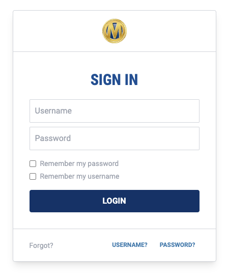
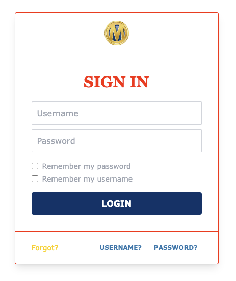

# @prism2/tailwind-preset

This package provides a [preset for TailwindCSS](https://tailwindcss.com/docs/presets) that applies PRISM design standards to your Tailwind projects. See an [example app in prism2-proto](../prism2-proto)


# Getting Started

> **Prerequisite** - See [Tailwind CSS Instllation Docs](https://tailwindcss.com/docs/installation) for more information.

## Install TailwindCSS

Install tailwindcss via npm, and create your tailwind.config.js file.

```
npm install -D tailwindcss @prism2/tailwind-preset
npx tailwindcss init
```

## Initialize with the preset

Add the paths to all of your template files in your tailwind.config.js file. Adding the preset will:

- Extends the theme with `@prism2/tailwind-theme`
- Loads the `@tailwindcss/typography` plugin.
- Loads the `@prism2/tailwind-elements` plugin with suggested settings.
- Watches the `src` directory for changes on matching file extensions.

```js
// tailwind.config.js
module.exports = {
  content: ["./src/**/*.{html,jsx,tsx,vue,mdx}"],
  presets: [
    require('@prism2/tailwind-preset')
  ]
}
```

## Extending the theme

You may want to use the design system but need to diverge from the core theme. You can extend the included base theme like any other theme.

```js
//tailwind.config.js
modules.exports = {
  content: ["./src/**/*.{html,jsx,tsx,vue,mdx}"],
  presets: [
    require('@prism2/tailwind-preset')
  ],
  theme: {
    extend: {
      fontFamily: {
        sans: 'Verdana',
        alt: 'Georgia'
      },
      colors: ({ theme }) => ({
        'headings': '#f00',
        'muted': '#ffcc00'
      }),
      borderColor: {
        DEFAULT: '#f00'
      }
    }
  }
}
```

Which would result in...

| Before | After |
| ------ | ------ |
|  |  |
